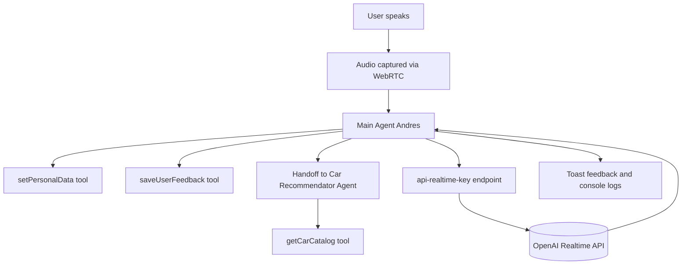

# One Step One Agent

A real-time AI-powered sales assistant designed to improve customer experience and conversion rates at **Kavak**.  
This system listens to the customer's voice, gathers personal preferences, and provides tailored car recommendations through a live conversational interface powered by the **OpenAI Realtime API**.

---

## Problem Description

Traditional car sales interactions are often slow and depend heavily on manual processes.  
Customers frequently abandon conversations when they can’t receive fast and personalized attention.

**Kavak Sales Copilot** solves this by introducing an **autonomous voice-driven agent** capable of:
- Listening and speaking in real time.  
- Collecting customer data and preferences.  
- Recommending cars based on budget, age, and needs.  
- Storing customer feedback for continuous improvement.

---

## System Architecture



## Key Components

- **Main Agent (Andres)**: Core conversation manager that interacts with the customer.
- **Car Recommendator Agent**: Specialized sub-agent that retrieves data from the internal catalog (cars_db).

## Tools:

- setPersonalData: Stores user data (name, age, budget, capacity, and car type).
- saveUserFeedback: Records the customer's evaluation and feedback.
- getCarCatalog: Retrieves car data from a predefined dataset.
-- scheduleAppointment: (optional) Books a follow-up meeting.

## Realtime Infrastructure:

- Audio handled via navigator.mediaDevices and WebRTC.
- Secure connection using ephemeral keys from /api/realtime-key.
- Communication with OpenAI Realtime API for low-latency interaction.

## Getting Started

### Prerequisites
- Node.js 18+ installed  
- Git  
- A valid OpenAI API key  

---

### Clone the Repository
```bash
git clone https://github.com/mvnueloc/one-step-one-agent/edit/master/README.md
cd one-step-one-agent
```

### Build and Run
```bash
npm install
npm run dev
```
Then open your browser and visit:
```bash
http://localhost:3000
```
